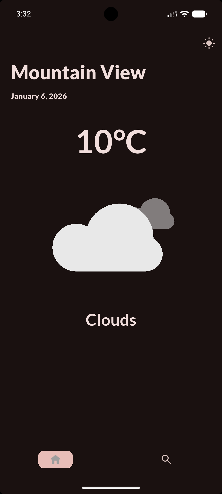
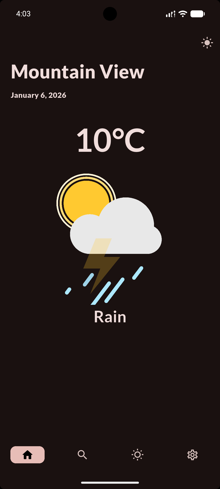

# minWeather 🌦️

A simple and clean weather application built with Flutter.  
The app fetches real-time weather data from an external API and displays current conditions in an easy-to-read interface.

This project was built to practice Flutter fundamentals, API integration, and UI design.

---

## ✨ Features

- Search weather by city name
- Real-time weather data
- Displays temperature, humidity, wind speed, and weather condition
- Clean and minimal UI
- Cross-platform support (Android, iOS, Web, Desktop)

---

## 🛠 Tech Stack

- Flutter
- Dart
- REST API
- HTTP package
- JSON parsing

---

## 📱 Screenshots

  
  

---
